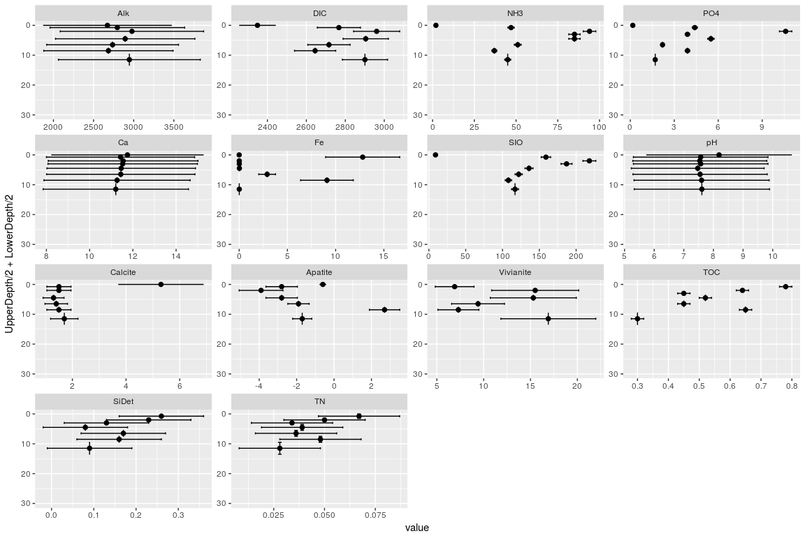
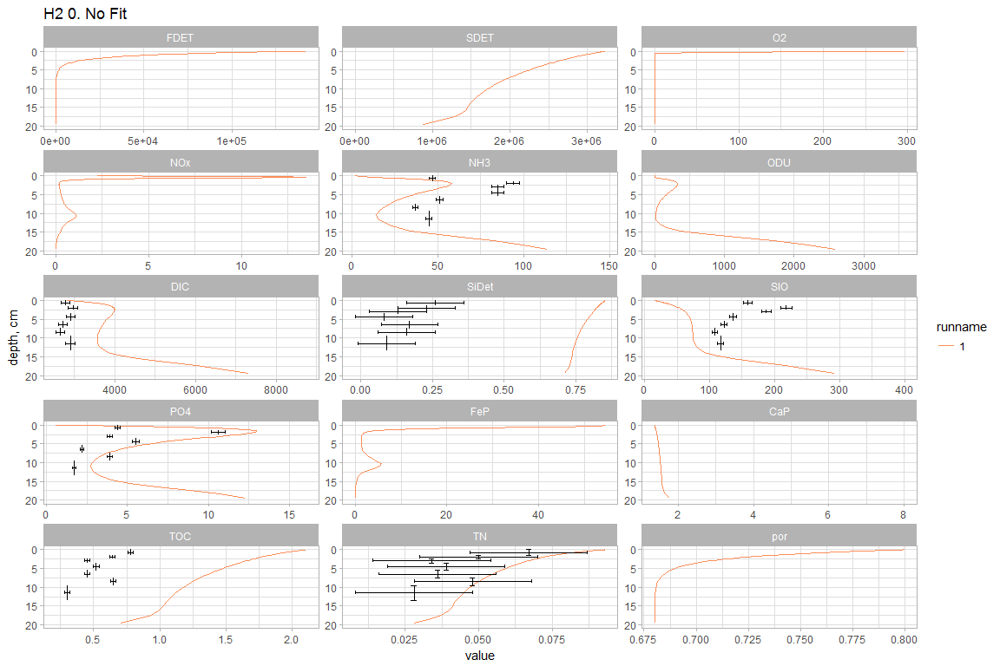
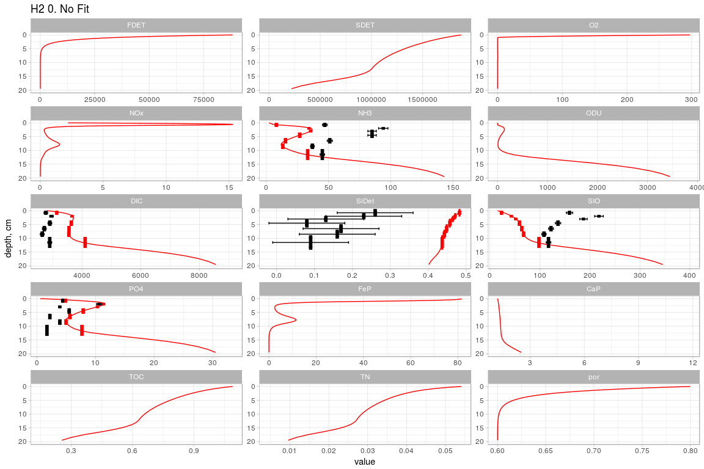
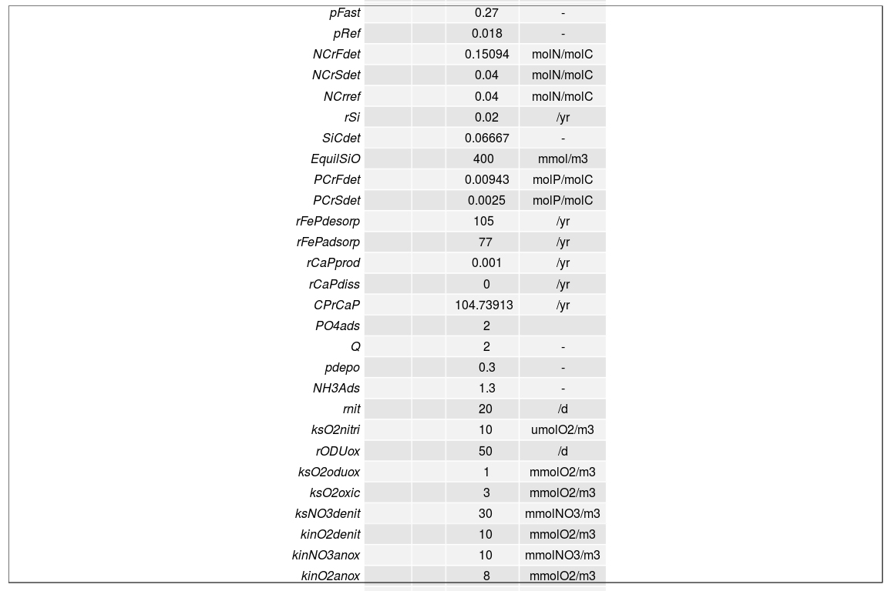
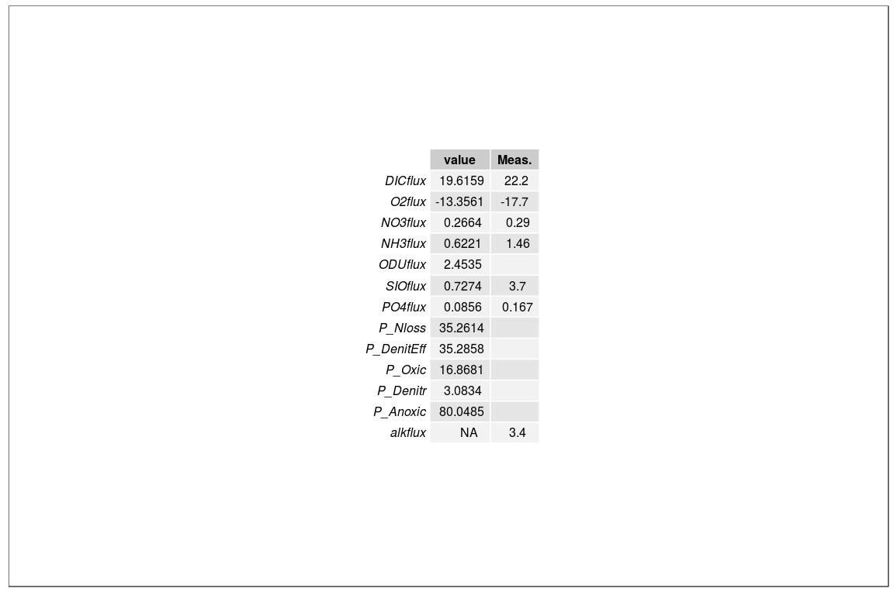
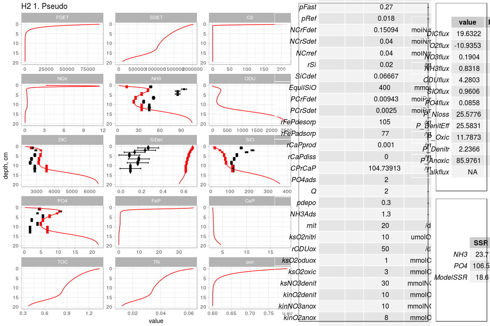

OmexdiaCalibration Tool Box: Minimal Example
================
Arthur Capet
Nov, 2017

-   [Example of use](#example-of-use)
-   [User Data](#user-data)
-   [Modal-Data metrics](#modal-data-metrics)
-   [Display](#display)

This script loads all the auxiliary functions, and runs + display a first simulation. It then provides an example of how to load data, compute model misfits for specific variables, and display the comparison with model ouptuts

``` r
# Loading OmexCal functions
source("Utils/OmexCal_Load.R")
```

Example of use
==============

The global variable `parSta` is used inside auxiliary functions. It contains the full parameter list as given in "OMEXDIA\_OG3\_BasicSetup.R"

``` r
# local copy of the global parameter vector
parSta<-pars

# OCALL gets the model solution for parameters given in argument
DIA <-OCALL(parSta)

# Display can be done directly with parameters value
Simplot(pars)
```



``` r
# .. or with model outputs -> TO UPDATE
# Simplot(DIA)
```

User Data
=========

User data are to be stored in a .xls file, respecitng the [user data file structure](datastructure.md). User-specific options (eg. filepahts, etc ..) are to be given in a file like (UsersDefinitions\_HAMMOND.R)\[UsersDefinitions\_HAMMOND.R\]

``` r


# This loads data the based on info given in the UserDefinitions....R
source('OmexCal_Load_Data.R')


# We then create "local" dataframes, specific to one station.
localdata    <- subset(dfProfiles, Station==sta & Campaign == cam)
localdatafl  <- subset(dfFluxes,   Station==sta & Campaign == cam)
localdatasta <- subset(dfStations, Station==sta & Campaign == cam)
```

Some parameters are general, some have to ba adapted for each station/campaign. This is the case, for instance, of the porosity grid and bottom water concentration for nutrients.

``` r
# In addition, some global parameters have to be given a local (station+campagin) value
parSta    <- OmexCal_AdaptForSta()

ggplot(localdata,
       aes(x=value,y=UpperDepth/2+LowerDepth/2,
             ymax=UpperDepth,ymin=LowerDepth,
             xmin=value-err, xmax=value+err))+
  geom_errorbar()+
  geom_errorbarh()+
  geom_point(size=2)+
  facet_wrap(~variable,scales = "free")+ylim(c(30,0))
```



Modal-Data metrics
==================

Once data are loaded, the generic cost function can be used while specifying which data should be used to asess the model skills.

``` r
#  Cost function can be called with a list of profile variables and a list of flux variables
 C1 <- OCOST_GEN(pars,Vlist = "NH3")
 C1$var
```

    ##   name     scale N SSR.unweighted SSR.unscaled      SSR
    ## 1  NH3 0.1428571 7       6820.193     1119.105 22.83888

``` r
 C2 <- OCOST_GEN(parSta,Vlist = "NH3")
 C2$var
```

    ##   name     scale N SSR.unweighted SSR.unscaled      SSR
    ## 1  NH3 0.1428571 7       4714.522     710.8764 14.50768

``` r
 C3 <- OCOST_GEN(parSta,Vlist = c("NOx","PO4","NH3"))
 C3$var
```

    ##   name     scale N SSR.unweighted SSR.unscaled       SSR
    ## 1  NH3 0.1428571 7      4714.5219     710.8764  14.50768
    ## 2  PO4 0.1428571 7       134.9338    6501.4381 132.68241

``` r
 C4 <- OCOST_GEN(parSta,Vlist = c("NH3","DIC"), Flist = c("SIO","NH3","NOx"))
 C4$var
```

    ##      name     scale N SSR.unweighted SSR.unscaled         SSR
    ## 1     DIC 0.1666667 6   1.301674e+06 103.32603984  2.87016777
    ## 2     NH3 0.1428571 7   4.714522e+03 710.87640967 14.50768183
    ## 3 SIOflux 1.0000000 1   4.810232e+00  13.36175439 13.36175439
    ## 4 NH3flux 1.0000000 1   9.309408e-05   0.02585947  0.02585947
    ## 5 NOxflux 1.0000000 1   1.082128e-02   3.00591053  3.00591053

Display
=======

The toolbox then contains a number of function to display model outputs and usefull summary tables.

``` r
# Some result display script, first one by one : 
Simplot(pars,plotdata=TRUE)+        # The flag TRUE is used to disaply the data along model ouputs
  ggtitle(paste(sta,"0. No Fit"))
```



``` r
partableplot(pars)
```



``` r
fluxtable(pars)$p
```



``` r
# Collect all on the same plot
grid.arrange(Simplot(parSta,TRUE)+ggtitle(paste(sta,"1. Pseudo")),
             arrangeGrob(partableplot(parSta)),
             arrangeGrob(fluxtable(parSta)$p,
                         fittableplot(C3),ncol=1,heights=c(6,4)),
             ncol = 3,nrow=1, widths=c(5*3,7,3), heights = c(12))
```


