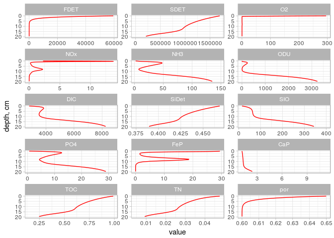
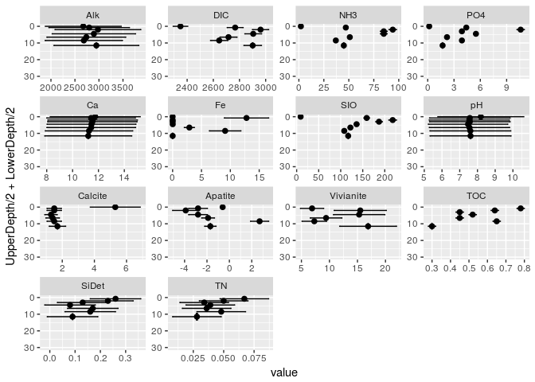
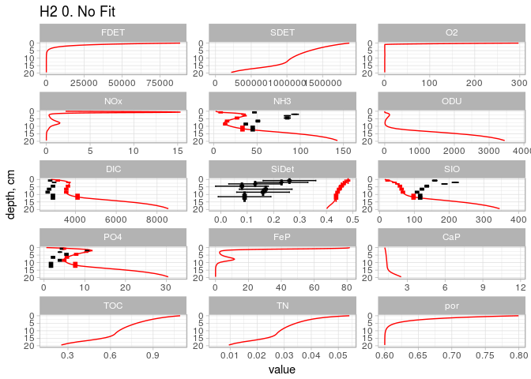
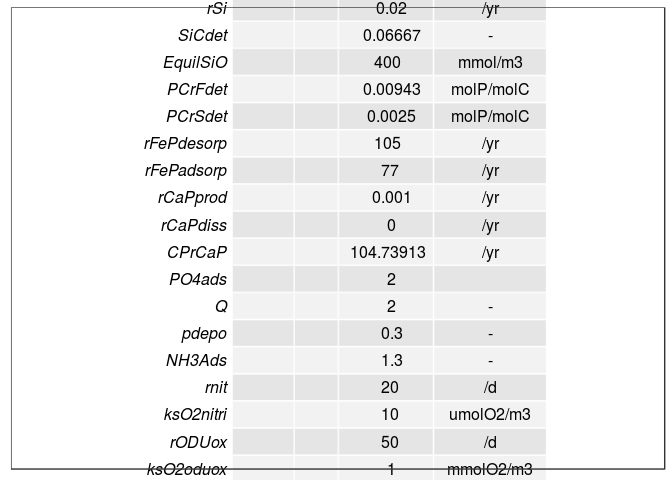
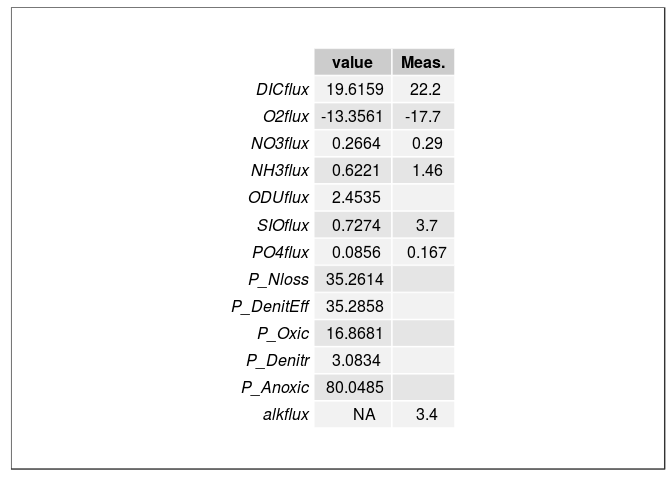
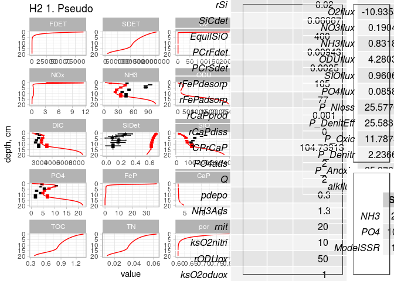

OmxediaCalibration Tool Box: Minimal Example
================
Arthur Capet
Nov, 2017

-   [Example of use](#example-of-use)
-   [User Data](#user-data)
-   [Modal-Data metrics](#modal-data-metrics)
-   [Display](#display)

This script loads all the auxiliary functions, and runs + display a first simulation. It then provides an example of how to load data, compute model misfits for specific variables, and display the comparison with model ouptuts

``` r
# Loading OmexCal functions
source("OmexCal_Load.R")
```

    ## Loading required package: gdata

    ## gdata: read.xls support for 'XLS' (Excel 97-2004) files ENABLED.

    ## 

    ## gdata: read.xls support for 'XLSX' (Excel 2007+) files ENABLED.

    ## 
    ## Attaching package: 'gdata'

    ## The following object is masked from 'package:stats':
    ## 
    ##     nobs

    ## The following object is masked from 'package:utils':
    ## 
    ##     object.size

    ## The following object is masked from 'package:base':
    ## 
    ##     startsWith

    ## Loading required package: ReacTran

    ## Loading required package: rootSolve

    ## Loading required package: deSolve

    ## Loading required package: shape

    ## Loading required package: marelac

    ## Loading required package: seacarb

    ## Loading required package: oce

    ## Loading required package: gsw

    ## Loading required package: testthat

    ## 
    ## Attaching package: 'marelac'

    ## The following objects are masked from 'package:oce':
    ## 
    ##     coriolis, gravity

    ## Loading required package: FME

    ## Loading required package: coda

    ## Loading required package: plyr

    ## Loading required package: gridExtra

    ## 
    ## Attaching package: 'gridExtra'

    ## The following object is masked from 'package:gdata':
    ## 
    ##     combine

    ## Loading required package: reshape2

Example of use
==============

The global variable `parSta` is used inside auxiliary functions. It contains the full parameter list as given in "OMEXDIA\_OG3\_BasicSetup.R"

``` r
# local copy of the global parameter vector
parSta<-pars

# OCALL gets the model solution for parameters given in argument
DIA <-OCALL(parSta)

# Display can be done directly with parameters value
Simplot(pars)
```

    ## Warning: Removed 16 rows containing missing values (geom_path).



``` r
# .. or with model outputs -> TO UPDATE
# Simplot(DIA)
```

User Data
=========

User data are to be stored in a .xls file, respecitng the [user data file structure](datastructure.md). User-specific options (eg. filepahts, etc ..) are to be given in a file like (UsersDefinitions\_HAMMOND.R)\[UsersDefinitions\_HAMMOND.R\]

``` r
source('UsersDefinitions_HAMMOND.R')

# This loads data the based on info given in the UserDefinitions....R
source('OmexCal_Load_Data.R')
```

    ## Warning in dir.create(plotdir): '/home/arthur/Desktop/DOCS/TEACHING/
    ## SedModelling/GitHub/OmexdiaCalibration/Plots_HAM' already exists

    ## Warning: Removed 44 rows containing missing values (geom_point).

    ## Warning: Removed 44 rows containing missing values (geom_errorbarh).

    ## Warning: Removed 3 rows containing missing values (geom_path).

    ## Warning: Removed 27 rows containing missing values (geom_point).

    ## Warning: Removed 27 rows containing missing values (geom_errorbarh).

    ## Warning: Removed 3 rows containing missing values (geom_path).

    ## Warning: Removed 7 rows containing missing values (geom_point).

    ## Warning: Removed 7 rows containing missing values (geom_errorbarh).

``` r
sta<-"H2"
cam<-"Sep89"

# We then create "local" dataframes, specific to one station.
localdata    <- subset(dfProfiles, Station==sta & Campaign == cam)
localdatafl  <- subset(dfFluxes,   Station==sta & Campaign == cam)
localdatasta <- subset(dfStations, Station==sta & Campaign == cam)
```

Some parameters are general, some have to ba adapted for each station/campaign. This is the case, for instance, of the porosity grid and bottom water concentration for nutrients.

``` r
# In addition, some global parameters have to be given a local (station+campagin) value
parSta    <- OmexCal_AdaptForSta()
```

    ## Warning in OmexCal_AdaptForSta(): Using local portop value for H2 Sep89

    ## Warning in OmexCal_AdaptForSta(): Using global porbot value for H2 Sep89

    ## Warning in OmexCal_AdaptForSta(): Using global pora value for H2 Sep89

    ## Warning in OmexCal_AdaptForSta(): Assuming Accumulation given in HAMMOND_Data.xls are gr/cm²/yr and a dry sediment density of 2.5 gr/cm³.
    ##           Consider adapting OmexCal_AdaptParsForStation if needed (or, better, convert your data)

``` r
ggplot(localdata,
       aes(x=value,y=UpperDepth/2+LowerDepth/2,
             ymax=UpperDepth,ymin=LowerDepth,
             xmin=value-err, xmax=value+err))+
  geom_errorbar()+
  geom_errorbarh()+
  geom_point(size=2)+
  facet_wrap(~variable,scales = "free")+ylim(c(30,0))
```

    ## Warning: Removed 9 rows containing missing values (geom_errorbar).

    ## Warning: Removed 9 rows containing missing values (geom_errorbarh).

    ## Warning: Removed 9 rows containing missing values (geom_point).



Modal-Data metrics
==================

Once data are loaded, the generic cost function can be used while specifying which data should be used to asess the model skills.

``` r
#  Cost function can be called with a list of profile variables and a list of flux variables
 C1 <- OCOST_GEN(pars,Vlist = "NH3")
 C1$var
```

    ##   name     scale N SSR.unweighted SSR.unscaled     SSR
    ## 1  NH3 0.1428571 7       12887.47      1793.37 36.5994

``` r
 C2 <- OCOST_GEN(parSta,Vlist = "NH3")
 C2$var
```

    ##   name     scale N SSR.unweighted SSR.unscaled      SSR
    ## 1  NH3 0.1428571 7       9017.879     1161.281 23.69961

``` r
 C3 <- OCOST_GEN(parSta,Vlist = c("NOx","PO4","NH3"))
 C3$var
```

    ##   name     scale N SSR.unweighted SSR.unscaled       SSR
    ## 1  NH3 0.1428571 7     9017.87943     1161.281  23.69961
    ## 2  PO4 0.1428571 7       75.55162     5217.510 106.47979

``` r
 C4 <- OCOST_GEN(parSta,Vlist = c("NH3","DIC"), Flist = c("SIO","NH3","NOx"))
 C4$var
```

    ##      name     scale N SSR.unweighted SSR.unscaled        SSR
    ## 1     DIC 0.1666667 6   1.031588e+06    239.07792   6.641053
    ## 2     NH3 0.1428571 7   9.017879e+03   1161.28102  23.699613
    ## 3 SIOflux 1.0000000 1   7.504223e+00     20.84506  20.845063
    ## 4 NH3flux 1.0000000 1   3.946040e-01    109.61222 109.612222

Display
=======

The toolbox then contains a number of function to display model outputs and usefull summary tables.

``` r
# Some result display script, first one by one : 
Simplot(pars,plotdata=TRUE)+        # The flag TRUE is used to disaply the data along model ouputs
  ggtitle(paste(sta,"0. No Fit"))
```

    ## Warning: Ignoring unknown aesthetics: y

    ## Warning: Ignoring unknown aesthetics: y

    ## Warning: Removed 16 rows containing missing values (geom_path).



``` r
partableplot(pars)
```



``` r
fluxtable(pars)$p
```

    ## No id variables; using all as measure variables



``` r
# Collect all on the same plot
#pdf(paste(plotdir,sta,"_Fit0.pdf",sep=""),width=5*(3+1)+2,height=15)
grid.arrange(Simplot(parSta,TRUE)+ggtitle(paste(sta,"1. Pseudo")),
             arrangeGrob(partableplot(parSta)),
             arrangeGrob(fluxtable(parSta)$p,
                         fittableplot(C3),ncol=1,heights=c(6,4)),
             ncol = 3,nrow=1, widths=c(5*3,7,3), heights = c(12))
```

    ## Warning: Ignoring unknown aesthetics: y

    ## Warning: Ignoring unknown aesthetics: y

    ## No id variables; using all as measure variables

    ## Warning: Removed 16 rows containing missing values (geom_path).



``` r
#dev.off()
```
